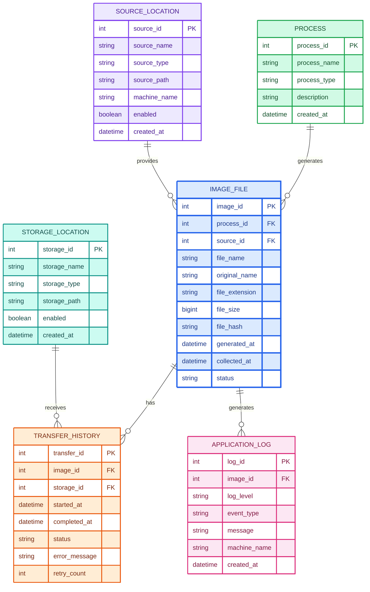

# TABLE STRUCTURE

**PPCS_IMG_INFO**

**PQC1_IMG_INFO**

| COLUMN      | DATA TYPE      |
| ----------- | -------------- |
| IMG_ID      | INT            |
| IMG_LABEL   | VARCHAR2(50)   |
| IMG_PATH    | VARCHAR2(150)  |
| IMG_SIZE    | DECIMAL(10, 2) |
| IMG_UP_TIME | DATE           |
| IMG_DL_TIME | DATE           |
| USER_ID     | VARCHAR2(15)   |

**PQC2_IMG_INFO**

| COLUMN      | DATA TYPE      |
| ----------- | -------------- |
| IMG_ID      | INT            |
| IMG_LABEL   | VARCHAR2(50)   |
| IMG_PATH    | VARCHAR2(150)  |
| IMG_SIZE    | DECIMAL(10, 2) |
| IMG_UP_TIME | DATE           |
| IMG_DL_TIME | DATE           |
| USER_ID     | VARCHAR2(15)   |
| Area        | VARCHAR2(7)    |

**Entity-Relation Diagram for the SP Image File Collector/Uploader**
